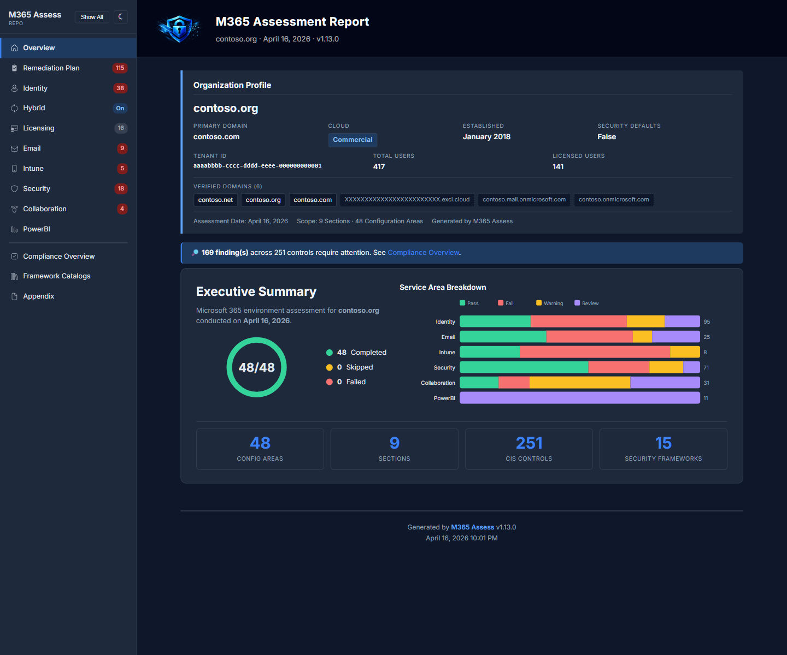
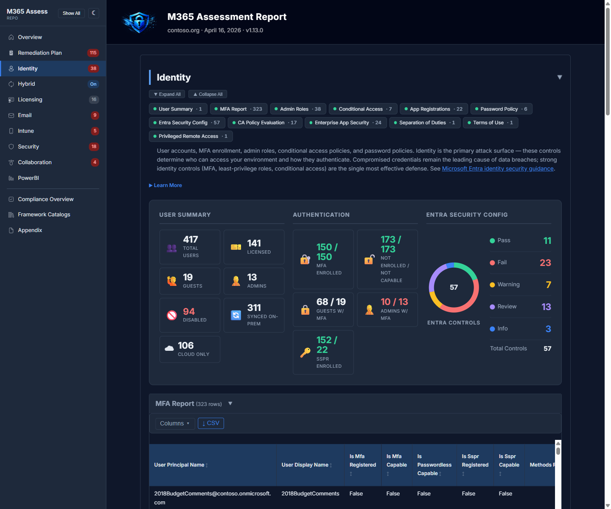
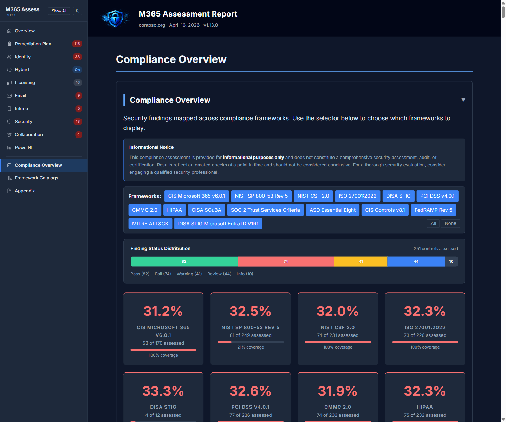

# M365 Assess

<div align="center">

<picture>
  <source media="(prefers-color-scheme: dark)" srcset="Common/assets/m365-assess-logo-white.png" />
  <source media="(prefers-color-scheme: light)" srcset="Common/assets/m365-assess-logo.png" />
  
</picture>

### Comprehensive M365 Security Assessment Tool

**Read-only Microsoft 365 security assessment for IT consultants and administrators**

[](https://github.com/Galvnyz/M365-Assess/actions/workflows/ci.yml)
[](https://learn.microsoft.com/en-us/powershell/scripting/install/installing-powershell-on-windows)
[](.)
[](.)
[](LICENSE)

</div>

---

Run a single command to produce CSV reports, a branded HTML assessment report, and an XLSX compliance matrix covering identity, email, security, devices, collaboration, and compliance baselines. **169 automated security checks** mapped across **14 compliance frameworks**.

## Quick Start

```powershell
# 1. Clone the repository
git clone https://github.com/Galvnyz/M365-Assess.git
cd M365-Assess

# 2. Install required modules (EXO pinned to 3.7.1 — see Compatibility docs)
Install-Module Microsoft.Graph -Scope CurrentUser
Install-Module ExchangeOnlineManagement -RequiredVersion 3.7.1 -Scope CurrentUser

# 3. Run the assessment
.\Invoke-M365Assessment.ps1 -TenantId 'contoso.onmicrosoft.com'

# Results land in a timestamped folder with CSV data + HTML report + XLSX compliance matrix
```

> **Downloaded the ZIP instead of cloning?** Windows marks ZIP-extracted files as "from the internet," which blocks execution under the default `RemoteSigned` policy. Unblock all scripts after extracting:
> ```powershell
> Get-ChildItem -Path .\M365-Assess -Recurse -Filter *.ps1 | Unblock-File
> ```
> This is not needed when using `git clone`.

## Prerequisites

| Requirement | Details |
|-------------|---------|
| **PowerShell 7.x** (`pwsh`) | Primary runtime. [Install guide](https://learn.microsoft.com/en-us/powershell/scripting/install/installing-powershell-on-windows) |
| **Microsoft.Graph** | `Install-Module Microsoft.Graph -Scope CurrentUser` |
| **ExchangeOnlineManagement** | `Install-Module ExchangeOnlineManagement -Scope CurrentUser` |
| **ImportExcel** *(optional)* | `Install-Module ImportExcel -Scope CurrentUser` for XLSX compliance matrix export |
| **Windows PowerShell 5.1** *(optional)* | Required only for the [ScubaGear](docs/SCUBAGEAR.md) section. Ships with Windows. |

### Platform Support

| Platform | Status |
|----------|--------|
| **Windows** | Fully tested |
| **macOS** | Experimental |
| **Linux** | Experimental |

macOS and Linux are supported by PowerShell 7 but have not been fully tested. If you run into issues, please [open an issue](https://github.com/Galvnyz/M365-Assess/issues/new) with your OS version, PowerShell version, terminal app, and the assessment log file.

## Interactive Console

Running the orchestrator with no parameters launches an interactive wizard that walks you through section selection, tenant ID, authentication method, and output folder.

```powershell
.\Invoke-M365Assessment.ps1
```

During execution, the console displays real-time streaming progress for each security check with color-coded status indicators:

<div align="center">

</div>

<details>
<summary>ASCII Banner</summary>

```
      ███╗   ███╗ ██████╗  ██████╗ ███████╗
      ████╗ ████║ ╚════██╗ ██╔════╝ ██╔════╝
      ██╔████╔██║  █████╔╝ ██████╗  ███████╗
      ██║╚██╔╝██║  ╚═══██╗ ██╔══██╗ ╚════██║
      ██║ ╚═╝ ██║ ██████╔╝ ╚█████╔╝ ███████║
      ╚═╝     ╚═╝ ╚═════╝   ╚════╝  ╚══════╝
       █████╗ ███████╗███████╗███████╗███████╗███████╗
      ██╔══██╗██╔════╝██╔════╝██╔════╝██╔════╝██╔════╝
      ███████║███████╗███████╗█████╗  ███████╗███████╗
      ██╔══██║╚════██║╚════██║██╔══╝  ╚════██║╚════██║
      ██║  ██║███████║███████║███████╗███████║███████║
      ╚═╝  ╚═╝╚══════╝╚══════╝╚══════╝╚══════╝╚══════╝
```

</details>

## Available Sections

| Section | Collectors | What It Covers |
|---------|-----------|----------------|
| **Tenant** | Tenant Info | Organization profile, verified domains, security defaults |
| **Identity** | User Summary, MFA Report, Admin Roles, Conditional Access, App Registrations, Password Policy, Entra Security Config | User accounts, MFA status, RBAC, CA policies, app registrations, consent settings, password protection |
| **Licensing** | License Summary | SKU allocation and assignment counts |
| **Email** | Mailbox Summary, Mail Flow, Email Security, EXO Security Config, DNS Authentication | Mailbox types, transport rules, anti-spam/phishing, modern auth, audit settings, external sender tagging, SPF/DKIM/DMARC |
| **Intune** | Device Summary, Compliance Policies, Config Profiles | Managed devices, compliance state, configuration profiles |
| **Security** | Secure Score, Improvement Actions, Defender Policies, Defender Security Config, DLP Policies, Stryker Incident Readiness | Microsoft Secure Score, Defender for Office 365, anti-phishing/spam/malware, Safe Links/Attachments, data loss prevention, incident readiness checks (stale admins, CA exclusions, break-glass, device wipe audit) |
| **Collaboration** | SharePoint & OneDrive, SharePoint Security Config, Teams Access, Teams Security Config, Forms Security Config | Sharing settings, external sharing controls, sync restrictions, Teams meeting policies, third-party app restrictions, Forms phishing/data sharing settings |
| **Hybrid** | Hybrid Sync | Azure AD Connect sync status and domain configuration |
| **PowerBI** | Power BI Security Config | 11 CIS 9.1.x tenant setting checks: guest access, external sharing, publish to web, sensitivity labels, service principal restrictions. Requires MicrosoftPowerBIMgmt module. |
| **Inventory** *(opt-in)* | Mailbox, Group, Teams, SharePoint, OneDrive Inventory | Per-object M&A inventory: mailboxes, distribution lists, M365 groups, Teams, SharePoint sites, OneDrive accounts |
| **ActiveDirectory** *(opt-in)* | AD Domain & Forest, AD DC Health, AD Replication, AD Security | Domain/forest topology, DC health via dcdiag, replication partners and lag, password policies, privileged group membership. Requires RSAT or domain controller access. |
| **SOC2** *(opt-in)* | Security Controls, Confidentiality Controls, Audit Evidence, Readiness Checklist | SOC 2 Trust Services Criteria assessment: security and confidentiality controls, 30-day audit log evidence collection, organizational readiness checklist for non-automatable criteria (CC1-CC5, CC8-CC9) |
| **ScubaGear** *(opt-in)* | CISA Baseline Scan | CISA SCuBA security baseline compliance ([details](docs/SCUBAGEAR.md)). Windows only. |

```powershell
# Run specific sections
.\Invoke-M365Assessment.ps1 -Section Identity,Email -TenantId 'contoso.onmicrosoft.com'

# Run everything including opt-in sections
.\Invoke-M365Assessment.ps1 -Section Tenant,Identity,Licensing,Email,Intune,Security,Collaboration,PowerBI,Hybrid,Inventory,ActiveDirectory,SOC2,ScubaGear -TenantId 'contoso.onmicrosoft.com'
```

## Parameters

| Parameter | Type | Default | Description |
|-----------|------|---------|-------------|
| `-Section` | string[] | Tenant, Identity, Licensing, Email, Intune, Security, Collaboration, PowerBI, Hybrid | Sections to assess. Add `Inventory`, `ScubaGear`, or other opt-in sections. |
| `-TenantId` | string | *(wizard prompt)* | Tenant ID or `*.onmicrosoft.com` domain |
| `-OutputFolder` | string | `.\M365-Assessment` | Base output directory |
| `-SkipConnection` | switch | | Skip service connections (use pre-existing) |
| `-ClientId` | string | | App Registration client ID for certificate auth |
| `-CertificateThumbprint` | string | | Certificate thumbprint for app-only auth |
| `-UserPrincipalName` | string | | UPN for interactive auth (avoids WAM broker issues) |
| `-UseDeviceCode` | switch | | Use device code flow for headless environments |
| `-NonInteractive` | switch | | Skip all interactive prompts; log errors and exit on required module issues, skip sections for optional ones |
| `-ManagedIdentity` | switch | | Use Azure managed identity auth (VMs, App Service, Functions) |
| `-ScubaProductNames` | string[] | aad, defender, exo, powerplatform, sharepoint, teams | ScubaGear products to scan |
| `-M365Environment` | string | `commercial` | Cloud environment: `commercial`, `gcc`, `gcchigh`, `dod` |
| `-NoBranding` | switch | | Generate report without M365 Assess branding |
| `-SkipDLP` | switch | | Skip DLP collector and Purview connection (saves ~46s) |
| `-SkipComplianceOverview` | switch | | Omit Compliance Overview section from report |
| `-SkipCoverPage` | switch | | Omit branded cover page from report |
| `-SkipExecutiveSummary` | switch | | Omit executive summary, show compact scan header instead |
| `-SkipPdf` | switch | | Skip PDF generation even when wkhtmltopdf is available |
| `-FrameworkFilter` | string[] | *(all)* | Limit compliance overview to specific framework families (e.g., `CIS`, `NIST`) |
| `-CustomBranding` | hashtable | | White-label reports. Keys: `CompanyName`, `LogoPath`, `AccentColor` |
| `-CisBenchmarkVersion` | string | `v6` | CIS benchmark version (`v6` for v6.0.1). Set to `v7` when available |
| `-ClientSecret` | SecureString | | App Registration client secret for app-only auth |

### Interactive Wizard

When no connection parameters are provided (`-TenantId`, `-SkipConnection`, `-ClientId`, or `-ManagedIdentity`), an interactive wizard prompts for tenant, auth method, and output folder. If `-Section` or `-OutputFolder` are provided on the command line, those wizard steps are skipped automatically.

See [Authentication](AUTHENTICATION.md) for detailed auth examples and App Registration setup.

## Module Helper

The orchestrator detects missing or incompatible PowerShell modules **before** connecting to any service. Detection is section-aware — only modules needed by the selected sections are checked.

| Module | Condition | Severity | Action |
|--------|-----------|----------|--------|
| Microsoft.Graph.Authentication | Not installed | Required | Install latest |
| ExchangeOnlineManagement | Not installed | Required | Install pinned 3.7.1 |
| ExchangeOnlineManagement | Version >= 3.8.0 | Required | Downgrade to 3.7.1 |
| msalruntime.dll | Missing (Windows + EXO 3.8.0+) | Required | Auto-copy from module path |
| MicrosoftPowerBIMgmt | Not installed | Optional | Skip PowerBI section |

In interactive mode, the repair flow presents two tiers of prompts:

1. **Tier 1 — Install missing modules** — single prompt to install all missing modules to `CurrentUser` scope
2. **Tier 2 — EXO downgrade** — separate confirmation to uninstall EXO >= 3.8.0 and install 3.7.1 (due to the [MSAL conflict](docs/COMPATIBILITY.md))

After repair, modules are re-validated. If issues remain, the exact manual commands are displayed and the script exits.

### Headless / Non-Interactive Mode

Add `-NonInteractive` (or run in a non-interactive session) to suppress all prompts:

```powershell
# CI/CD pipeline — exit cleanly if modules are missing
.\Invoke-M365Assessment.ps1 -TenantId 'contoso.onmicrosoft.com' `
    -ClientId 'app-id' -CertificateThumbprint 'thumbprint' `
    -NonInteractive
```

**Behavior in non-interactive mode:**

- **Required module issues** — each issue is logged with the exact install command, then the script exits with an error
- **Optional module issues** — the dependent section is removed from the run and a warning is logged; the assessment continues with remaining sections
- **Blocked scripts (ZIP download)** — the unblock command is logged and the script exits

The assessment log (`_Assessment-Log_<tenant>.txt`) captures all module issue details and fix commands for operator review.

### Blocked Script Detection

On Windows, files extracted from a ZIP are tagged with an NTFS Zone.Identifier that blocks execution under `RemoteSigned` policy. The orchestrator detects this automatically:

- **Interactive** — prompts to run `Unblock-File` on all `.ps1` files
- **Non-interactive** — logs the command and exits

## Output Structure

```
M365-Assessment/
  Assessment_YYYYMMDD_HHMMSS_<tenant>/
    01-Tenant-Info.csv
    02-User-Summary.csv
    03-MFA-Report.csv
    04-Admin-Roles.csv
    05-Conditional-Access.csv
    06-App-Registrations.csv
    07-Password-Policy.csv
    07b-Entra-Security-Config.csv
    08-License-Summary.csv
    09-Mailbox-Summary.csv
    10-Mail-Flow.csv
    11-EXO-Email-Policies.csv
    11b-EXO-Security-Config.csv
    12-DNS-Email-Authentication.csv
    13-Device-Summary.csv
    14-Compliance-Policies.csv
    15-Config-Profiles.csv
    15b-Intune-Security-Config.csv
    16-Secure-Score.csv
    17-Improvement-Actions.csv
    18-Defender-Policies.csv
    18b-Defender-Security-Config.csv
    19-DLP-Policies.csv
    19b-Compliance-Security-Config.csv
    19c-Purview-Retention-Config.csv
    20-SharePoint-OneDrive.csv
    20b-SharePoint-Security-Config.csv
    21-Teams-Access.csv
    21b-Teams-Security-Config.csv
    21c-Forms-Security-Config.csv
    22-PowerBI-Security-Config.csv
    23-Hybrid-Sync.csv
    _Assessment-Summary_<tenant>.csv     # Status of every collector
    _Assessment-Log_<tenant>.txt         # Timestamped execution log
    _Assessment-Issues_<tenant>.log      # Issue report with recommendations
    _Assessment-Report_<tenant>.html     # Self-contained HTML report
    _Compliance-Matrix_<tenant>.xlsx     # Framework compliance matrix (requires ImportExcel)
```

## Report Preview

The self-contained HTML report opens in any browser with no dependencies. Click through from the cover page to the executive summary, drill into each security domain, and review compliance posture across 14 frameworks.

<div align="center">



<br /><br />



<br /><br />


<br /><br />



</div>

> See [docs/sample-report/Example-Report.html](docs/sample-report/Example-Report.html) for a full PII-scrubbed example report.

## Project Structure

```
M365-Assess/
  Invoke-M365Assessment.ps1      # Orchestrator - main entry point
  ActiveDirectory/                # Hybrid sync, AD domain/DC/replication/security
  Collaboration/                  # SharePoint, OneDrive, Teams
  Common/                         # Shared helpers
    assets/                       # Branding assets (logo, backgrounds)
    Connect-Service.ps1           # Service connection helper
    Export-AssessmentReport.ps1   # HTML report generator
    Export-ComplianceMatrix.ps1   # XLSX compliance matrix export
    Show-CheckProgress.ps1       # Real-time progress display
  controls/                       # Control registry and framework mappings
    registry.json                 # Master registry (244 entries, 160 automated)
    frameworks/                   # Per-framework mapping files
  Entra/                          # Users, MFA, admin roles, CA, apps, licensing, security config
  Exchange-Online/                # Mailboxes, mail flow, email security, EXO config
  Inventory/                      # M&A inventory: mailboxes, groups, Teams, SharePoint, OneDrive
  Intune/                         # Devices, compliance, config profiles
  Networking/                     # Port scanning, DNS, connectivity
  PowerBI/                        # Power BI tenant security settings (CIS 9.x)
  Purview/                        # DLP policies, audit retention
  Security/                       # Secure Score, Defender, DLP, ScubaGear
  Setup/                          # App Registration provisioning scripts
  docs/                           # Detailed documentation
```

## Documentation

| Guide | Description |
|-------|-------------|
| [Authentication](AUTHENTICATION.md) | Interactive, certificate, device code, managed identity, and pre-existing connection methods |
| [HTML Report](REPORT.md) | Report features, custom branding, `-NoBranding`, standalone generation |
| [Compliance](COMPLIANCE.md) | 14 frameworks, XLSX export, CheckId system, control registry |
| [Compatibility](docs/COMPATIBILITY.md) | Module versions, dependency matrix, known incompatibilities |
| [ScubaGear](docs/SCUBAGEAR.md) | CISA baseline integration, first run, products, GCC support |
| [CheckId Guide](docs/CheckId-Guide.md) | CheckId naming convention and mapping reference |
| [Security](SECURITY.md) | Vulnerability reporting and security policy |

## Individual Scripts

Every collector can be run standalone outside the orchestrator:

```powershell
# Connect to the required service first
. .\Common\Connect-Service.ps1
Connect-Service -Service Graph -Scopes 'User.Read.All','UserAuthenticationMethod.Read.All'

# Run a single collector
.\Entra\Get-MfaReport.ps1
```

### Standalone Scripts

Individual collectors and report generation can run independently of the full assessment:

| Script | Purpose |
|--------|---------|
| `Entra/Get-MfaReport.ps1` | MFA enrollment and capability report |
| `Entra/Get-InactiveUsers.ps1` | Users inactive for 90+ days |
| `Exchange-Online/Get-MailFlowReport.ps1` | Mail flow rules and connectors |
| `Common/Export-AssessmentReport.ps1` | Regenerate HTML report from existing CSVs |
| `Common/Export-ComplianceMatrix.ps1` | Generate XLSX compliance matrix |

Each collector requires a Graph or Exchange Online connection first:

```powershell
. .\Common\Connect-Service.ps1
Connect-Service -Service Graph -Scopes 'User.Read.All','AuditLog.Read.All'
.\Entra\Get-InactiveUsers.ps1 -DaysInactive 90
```

## Getting Help

```powershell
Get-Help .\Invoke-M365Assessment.ps1 -Full
Get-Help .\Common\Export-AssessmentReport.ps1 -Examples
```

## Contributing

Contributions are welcome! See [CONTRIBUTING.md](CONTRIBUTING.md) for guidelines.

## License

This project is licensed under the MIT License. See [LICENSE](LICENSE) for details.

---

<div align="center">
<sub>Built by <a href="https://github.com/Daren9m">Daren9m</a> and contributors</sub>
</div>
